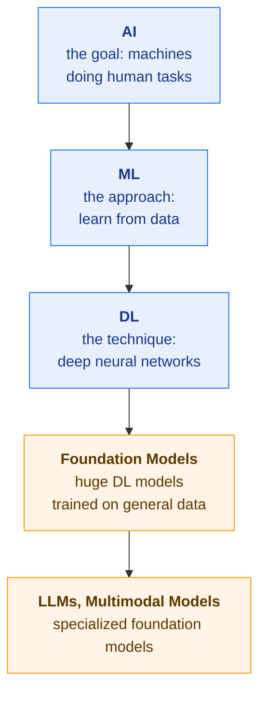
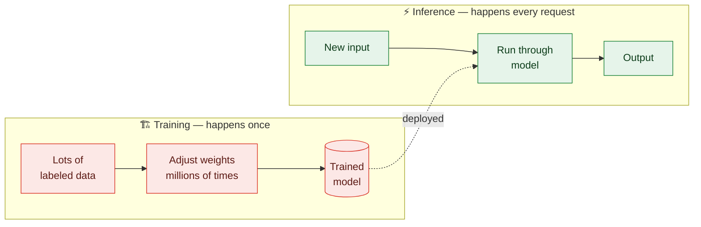
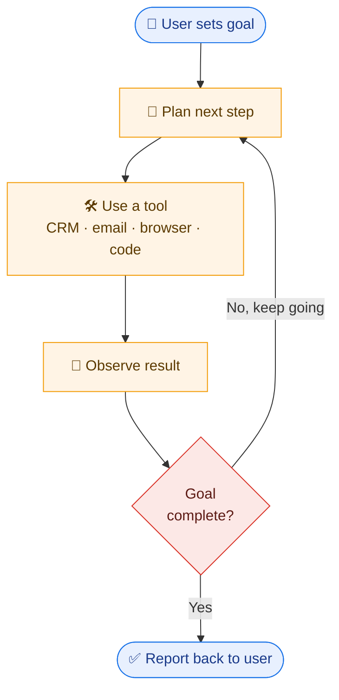

# ☕ AI Espresso #1 — From AI to Agents

> **The full cup.** This is the deep-dive companion to our Slack post.
> Goal: by the end of this read (~15 minutes), you'll understand the entire AI landscape — from the broadest definition of AI all the way to autonomous agents — even if you've never touched tech before.
>
> No math. No jargon left unexplained. Just the mental models you need to talk about AI confidently and use it well in your day-to-day work.

---

## Table of Contents

1. [AI — What it actually is](#1-ai--what-it-actually-is)
2. [ML & DL — How machines learn](#2-ml--dl--how-machines-learn)
3. [Training — How a model is born](#3-training--how-a-model-is-born)
4. [Model — The thing you actually use](#4-model--the-thing-you-actually-use)
5. [Foundation Models — The big shift](#5-foundation-models--the-big-shift)
6. [LLMs — Language as the universal interface](#6-llms--language-as-the-universal-interface)
7. [Multimodal Models — Beyond just text](#7-multimodal-models--beyond-just-text)
8. [Agents — From answering to acting](#8-agents--from-answering-to-acting)
9. [So what is Claude, exactly?](#9-so-what-is-claude-exactly)
10. [Quick glossary](#10-quick-glossary)

---

## 1. AI — What it actually is

**AI (Artificial Intelligence)** is the field of building machines — both hardware and software — that can do tasks once limited to humans.

That's it. That's the whole definition. The word "intelligence" makes it sound mystical, but in practice AI just means: _a computer doing something we used to think only people could do._

A few decades ago, "recognizing a face in a photo" was considered impossible for a computer. Today your phone unlocks itself by looking at you. That task moved from the "human-only" column to the "AI" column. The same is happening, right now, to thousands of other tasks:

- Recognizing faces and objects in images
- Playing chess (and beating world champions)
- Writing essays, emails, and code
- Forecasting next quarter's sales
- Driving a car
- Diagnosing diseases from X-rays

### Why people get confused about AI

You'll hear AI used in two different ways, and they're both correct:

1. **AI as a field of study** — like physics or biology. Universities have AI departments. Researchers publish AI papers.
2. **AI as a product** — "this app uses AI." Here it usually means the app has some learning component baked in.

When your CEO says "we need an AI strategy," they mean #2. When a researcher says "I work in AI," they mean #1.

### Real-world examples you've already used

- 🔓 **Face ID** unlocking your iPhone
- 📧 **Gmail's spam filter** sending junk to the spam folder
- 🌐 **Google Translate** converting a menu in real time through your camera
- 🎬 **Netflix's recommendations** for what to watch next

You've been using AI for years. The recent excitement isn't that AI exists — it's that AI suddenly got dramatically better at language and reasoning.

---

## 2. ML & DL — How machines learn

If AI is the goal (machines doing human-like tasks), **ML and DL are the techniques** we use to get there.

### Machine Learning (ML)

**Machine Learning** is the approach where, instead of writing rules by hand, you give the computer lots of _examples_ and let it figure out the rules itself.

Imagine you wanted to build a spam filter the old way. You'd sit down and write rules:

- If the email contains "FREE MONEY" → spam
- If the sender isn't in my contacts → maybe spam
- If there are too many exclamation marks → probably spam

This works for a while, but spammers change their tactics, and you'd be writing rules forever.

The ML approach is different:

1. Show the computer **100,000 emails** that humans have already labeled as "spam" or "not spam."
2. The computer studies them and figures out the patterns _on its own_.
3. Now when a new email arrives, the computer applies what it learned.

You didn't write the rules. The computer extracted them from the data. That's the whole idea.

### What kinds of questions can ML answer?

Anywhere you have data and want to predict, classify, or detect something:

| Question                                | Used in                                |
| --------------------------------------- | -------------------------------------- |
| What's this house worth?                | Real estate (Zillow's Zestimate)       |
| Is this email spam?                     | Email providers                        |
| Which leads are most likely to convert? | Sales (lead scoring)                   |
| Which invoices look fraudulent?         | Finance, accounting                    |
| Which customers are about to churn?     | Customer success, SaaS                 |
| What product should we recommend next?  | E-commerce, streaming                  |
| Will this machine break down soon?      | Manufacturing (predictive maintenance) |

If you have historical data and a question you'd like to answer about the future, ML probably applies.

### Deep Learning (DL)

**Deep Learning** is a specific _type_ of machine learning — the kind that uses **neural networks** with many layers (hence "deep").

Without going into the math: a neural network is a system loosely inspired by the brain. Information flows through layers of connected "neurons," each one doing a tiny calculation, and the network learns by adjusting how strongly each connection fires.

Why does this matter? Because deep learning is what unlocked modern AI. The ChatGPT moment, image generation, voice cloning, self-driving cars — these all became possible because deep learning got much better in the last 10–15 years, mostly thanks to:

- More data (the internet)
- Faster chips (GPUs)
- Better techniques (especially the **Transformer** architecture from 2017)

### The relationship

Every LLM is a deep learning model. Every deep learning model is machine learning. All machine learning is AI.

---

## 3. Training — How a model is born

**Training** is the process of teaching a computer by feeding it lots of data.

Here's what actually happens during training, simplified:

1. **Show the computer an example.** ("Here's an email. Is it spam or not?")
2. **Let it guess.** It outputs "spam" with 60% confidence.
3. **Tell it the right answer.** "Actually, this one wasn't spam."
4. **Adjust.** The computer tweaks its internal numbers slightly so that _next time_ it's a little less confident this email is spam.
5. **Repeat — millions of times.**

After enough rounds, the computer has been nudged into a state where it's right most of the time. That state — those finely tuned internal numbers — is what we call the **model**.

### Two important things to know about training

**1. It's expensive and slow.**
Training a small business-specific model might take a few hours on a regular cloud server. Training a frontier model like Claude or GPT-4 takes **months**, **thousands of specialized GPU chips**, and **tens to hundreds of millions of dollars** in compute alone.

**2. You usually don't train from scratch.**
This is the key insight that makes modern AI practical. Almost no one trains a foundation model from scratch — there are maybe a dozen organizations in the world that do. Everyone else takes a pre-trained model and either uses it as-is or _fine-tunes_ it (a much cheaper, smaller round of additional training on their specific data).

### Real examples of training

- **OpenAI** spent months and an estimated $100M+ training GPT-4 on trillions of words from the internet, books, and code.
- **Anthropic** does the same for Claude.
- A **junior data scientist** on your team might train a churn prediction model on 2 years of customer data using a free tool like scikit-learn, on a single laptop, in a few hours.
- **Tesla** continuously retrains its self-driving model on new edge-case footage uploaded from its fleet of cars.

The scale ranges from "overnight on a laptop" to "national-grid-scale electricity consumption." Same idea, different magnitudes.

---

## 4. Model — The thing you actually use

A **model** is the result of training — a file full of numbers (called _weights_) that captures everything the system learned from the data.

That's literally what it is. If you opened the file, you'd see billions of decimal numbers and nothing else. Those numbers encode all the patterns the model picked up during training.

### How you use a model

You feed it an input → it gives you a prediction.

- Input: an email → Output: "spam" or "not spam"
- Input: a photo → Output: "cat", "dog", or "bird"
- Input: "Write me a poem about coffee" → Output: a poem about coffee
- Input: a customer's profile → Output: "85% likely to churn in 30 days"

The act of _running_ a trained model on new input is called **inference**. You'll hear this term constantly:

- _"Inference cost"_ — how much it costs to run the model once
- _"Inference latency"_ — how long it takes to get an answer
- _"Inference API"_ — the endpoint you call to use a model

So the lifecycle is:

> **Training** _produces_ a model. **Inference** _uses_ the model.
> Training happens once (or occasionally). Inference happens every time someone asks the model a question.

### Real examples of models

- `claude-opus-4.7`, `gpt-4-turbo`, `gemini-2.5-pro` — specific models you can call by name via API. Each is a specific trained file living on a server.
- `Llama-3-70B` — Meta's open-weight model. You can literally download a ~140 GB file and run it on your own hardware.
- A `.pkl` file on a data scientist's laptop containing a trained model that predicts house prices.

### Why this matters for our team

When someone says "we're using AI," ask: _which model?_ Different models have different capabilities, costs, and limitations. "GPT-4" and "GPT-3.5" are both AI, both LLMs, but the gap between them is enormous in quality and price.

---

## 5. Foundation Models — The big shift

This is the concept that explains why AI feels different in 2026 than it did in 2020.

**Foundation Models** are massive models trained on huge, general datasets — and then adapted to many different tasks.

### The "before" era

Before foundation models (roughly pre-2020), AI worked like this:

> _One model, one task._

You wanted a spam filter? Train a spam filter model. You wanted a sales forecaster? Train a separate sales forecaster model. You wanted to translate French to English? That's a third model. Each model was trained from scratch, on task-specific data, by a team of specialists. Building each one took months and a lot of money.

### The "after" era

A foundation model is trained once, on a _general_ dataset (much of the internet, all kinds of books, code, etc.), and ends up with a kind of broad, general competence. Then you can adapt that one model to do many different tasks:

- Draft a sales email
- Summarize a support ticket
- Explain a legal contract
- Translate between languages
- Write Python code
- Answer questions about your company's HR policy

…all from the **same model**. No retraining required for most of these — you just _prompt_ it with what you want.

This is why "AI" suddenly seems to be everywhere all at once. We didn't build thousands of new models. We built a few very capable foundation models, and now everyone is building products on top of them.

### The analogy that helps

A traditional ML model is like hiring a specialist who only knows one job. Want them to do something different? Train a new specialist.

A foundation model is like hiring a smart, well-read generalist. They've read enormous amounts and have broad knowledge. You can ask them to do many things, and they'll be reasonably good at most of them — and excellent at some, especially with a bit of guidance.

### Real examples

- **Claude** (Anthropic) — used for chat, coding, document analysis, agents
- **GPT-4 / GPT-5** (OpenAI) — powers ChatGPT, Microsoft Copilot, thousands of products
- **Gemini** (Google) — powers Google Search AI Overviews, Google Workspace AI
- **Llama** (Meta) — open-weight, can run on your own infrastructure

These are the foundations. Most "AI products" you encounter are built on top of one of these.

---

## 6. LLMs — Language as the universal interface

**LLMs (Large Language Models)** are foundation models that specialize in language.

They were trained on enormous amounts of text — books, articles, websites, code, conversations — until they got really good at predicting what word comes next in a sentence. That sounds simple, almost too simple, but it turns out that getting _very_ good at "what word comes next" requires understanding grammar, facts, reasoning, tone, structure, and much more.

The result: an LLM can read, write, summarize, translate, classify, explain, and code — all through the same interface: text in, text out.

### Why LLMs are useful across the whole company, not just engineering

Almost every job involves reading and writing. So LLMs help almost every job:

| Function             | Example use                                                       |
| -------------------- | ----------------------------------------------------------------- |
| **Sales**            | Draft personalized outreach emails based on a prospect's LinkedIn |
| **Marketing**        | Generate ad copy variations, blog drafts, social posts            |
| **Customer Success** | Summarize a long support thread, draft a reply                    |
| **HR**               | Answer policy questions from an employee handbook                 |
| **Finance**          | Extract line items from messy expense reports                     |
| **Legal**            | Summarize a contract, flag unusual clauses                        |
| **Operations**       | Convert messy emails into structured tickets                      |
| **Engineering**      | Write code, review PRs, explain unfamiliar codebases              |
| **Leadership**       | Summarize 50-page reports into 1-page briefings                   |

If a task involves words, an LLM can probably help with it.

### Real examples

- **ChatGPT** — most people's first encounter with LLMs
- **Claude** — also an LLM (we'll come back to "what exactly is Claude" at the end)
- **GitHub Copilot** — an LLM autocompleting code in your editor
- **Notion AI** — summarizing your docs and meeting notes
- **Intercom Fin** — answering customer support tickets automatically

### A critical caveat: hallucinations

LLMs can confidently produce wrong information. They were trained to sound right, not necessarily to _be_ right. They can invent fake citations, get dates wrong, misremember facts. This is called **hallucination**.

The practical implication: LLMs are powerful tools, but they're not oracles. Always verify anything that matters — numbers, names, legal claims, code that's about to ship to production. Treat LLM output like a smart but occasionally-overconfident intern's first draft.

---

## 7. Multimodal Models — Beyond just text

**Multimodal Models** are foundation models that handle multiple input types — text, images, audio, video — in a single model.

A pure LLM only reads and writes text. A multimodal model can also _see_ images, _hear_ audio, _watch_ video, and respond accordingly. Most modern frontier models (Claude, GPT-4, Gemini) are multimodal.

### What "multimodal" unlocks in practice

| Input                         | What you can ask for              | Useful for                |
| ----------------------------- | --------------------------------- | ------------------------- |
| 📸 Screenshot of a dashboard  | "What insights stand out?"        | Analytics, reporting      |
| 🧾 Photo of a scanned invoice | "Extract line items as JSON"      | Finance, accounts payable |
| 🎙️ Recording of a sales call  | "Summarize and list action items" | Sales, CS                 |
| 🏭 Photo of a warehouse shelf | "What's running low?"             | Operations, inventory     |
| ✍️ Whiteboard sketch of a UI  | "Generate the HTML/CSS"           | Design, engineering       |
| 📊 A messy spreadsheet        | "Clean this up and make a chart"  | Anyone with data          |
| 📷 Product photo              | "Write three marketing taglines"  | Marketing                 |
| 📄 A 50-page PDF report       | "Extract key findings"            | Research, leadership      |

### Real examples

- Uploading a photo of a whiteboard sketch to Claude and getting working HTML/CSS code back
- ChatGPT's voice mode having a real-time spoken conversation with you
- Gemini watching a YouTube video and answering questions about it
- Snapping a photo of a fridge's contents and asking "what can I cook?"

The pattern: any time information lives in a non-text format (an image, a recording, a video), multimodal models let you bring it into an AI workflow without having to manually transcribe or describe it first.

---

## 8. Agents — From answering to acting

This is where AI gets genuinely transformative for business — and where most of the exciting product work in 2026 is happening.

**Agents** are AI systems that _act_, not just answer.

An LLM, by itself, can only produce text. You ask, it answers. That's it.

An agent takes the same underlying LLM and wraps it in a loop:

1. **Goal:** the user gives the agent an objective. _"Send a follow-up to every prospect who hasn't replied in 7 days."_
2. **Plan:** the agent breaks the goal into steps.
3. **Tools:** the agent has access to real systems — your CRM, your email, your calendar, a web browser, your codebase, your file system.
4. **Act:** the agent uses a tool. It pulls the prospects from the CRM.
5. **Observe:** it sees the result of the action.
6. **Adjust:** it decides the next step based on what it found.
7. **Loop** until the goal is complete.

The key shift: instead of _you_ being the one who reads, decides, and clicks, the agent does it for you. You become the goal-setter and reviewer rather than the operator.

### A concrete sales-agent example

**Without an agent (just an LLM):**

> You: "Draft a follow-up email to this prospect."
> LLM: _gives you a generic draft_
> You: copy it, open Salesforce, find the right contact, paste, edit, send.

**With an agent:**

> You: "Follow up with everyone in my pipeline who's gone quiet for more than a week."
> Agent: queries Salesforce for stale deals → checks each prospect's recent activity → drafts a tailored email per person → schedules sends → updates the CRM with notes → reports back: _"Sent 14 follow-ups. 3 prospects had recent LinkedIn activity, so I referenced it in their emails."_

You went from doing 14 tasks to reviewing 1 summary.

### A concrete engineering-agent example

**Without an agent:** "Write a function that does X." → you copy the code into your editor → you write tests → you run them → you fix bugs → you open a PR.

**With an agent (e.g., Claude Code):** "Add feature X with tests." → the agent reads your repo to understand the codebase → writes the code → writes the tests → runs them → fixes its own bugs → opens a PR → tags you for review.

### What makes agents work

Three things had to come together:

1. **Capable LLMs** — smart enough to plan and reason about real tasks.
2. **Tool use** — the ability for an LLM to call external systems (APIs, databases, websites).
3. **Standards like MCP (Model Context Protocol)** — a common way to plug agents into existing systems (GitHub, Jira, your codebase, Salesforce, etc.) without custom integration work for each one.

### Real examples

- **Claude Code** — autonomous coding agent that works in your terminal or editor
- **Cursor / Devin** — AI coding agents that complete tickets end-to-end
- **OpenAI Operator** — browses the web, books flights, fills out forms
- **Lindy / Relay.app** — business-process agents (monitor inbox, qualify leads, update CRM, reply)

### Why this is the direction the team is heading

Most of the productivity gains from "AI in your workflow" will come from agents, not from people typing prompts into chatbots. A chatbot saves you minutes. A well-deployed agent saves you hours and removes whole categories of work from your plate.

That's why this series exists, and why we're rolling out agent-based tooling across our development process.

---

## 9. So what is Claude, exactly?

A reasonable question after reading all this: is Claude an LLM? A foundation model? A multimodal model? An agent?

**Answer: Claude is all of those at once, depending on which lens you look through.**

It's like asking "is a Tesla a car, an electric vehicle, or a self-driving system?" — yes, yes, and yes. They're different layers of the same thing.

Here's the full stack:

| Lens                         | What Claude is                                                 |
| ---------------------------- | -------------------------------------------------------------- |
| **At its core**              | A foundation model — trained on enormous general data          |
| **More specifically**        | An LLM — specialized in language                               |
| **Even more specifically**   | A multimodal LLM — also handles images, PDFs, documents        |
| **When equipped with tools** | An agent — e.g., Claude Code reading your repo and opening PRs |

Or in one sentence:

> **Claude is a multimodal LLM built on a foundation model architecture. When equipped with tools and goals, it operates as an agent.**

The model is the _brain_. Whether it shows up as "a chatbot" or "an agent" depends on what you wrap around it. Same brain, different jobs.

This same logic applies to GPT-4, Gemini, and other frontier models. They're all foundation models → that are LLMs → that are multimodal → that can be used as agents.

---

## 10. Quick glossary

For your reference, in plain English:

- **AI** — machines doing tasks once limited to humans.
- **ML (Machine Learning)** — teaching machines by showing them examples instead of writing rules.
- **DL (Deep Learning)** — ML using deep neural networks. Powers most modern AI.
- **Neural network** — a brain-inspired system of connected mathematical "neurons" that learns by adjusting connections.
- **Training** — the process of teaching a model by feeding it data, repeated millions of times.
- **Weights** — the billions of numbers inside a model that encode what it learned.
- **Model** — the final trained file. The thing you actually use.
- **Inference** — running a model on new input to get an output. The opposite of training.
- **Foundation Model** — a massive model trained once on general data and adapted to many tasks.
- **LLM (Large Language Model)** — a foundation model specialized in language.
- **Multimodal Model** — a foundation model that handles text, images, audio, and/or video.
- **Hallucination** — when an LLM produces confident-sounding but false information.
- **Prompt** — the instruction you give to an LLM.
- **Fine-tuning** — a small extra round of training to specialize a foundation model for a narrower task.
- **Agent** — an AI system that can plan, use tools, and act on goals — not just answer.
- **Tool use** — an LLM's ability to call external systems (APIs, databases, browsers).
- **MCP (Model Context Protocol)** — an emerging standard for connecting agents to external systems like GitHub, Jira, and CRMs.
